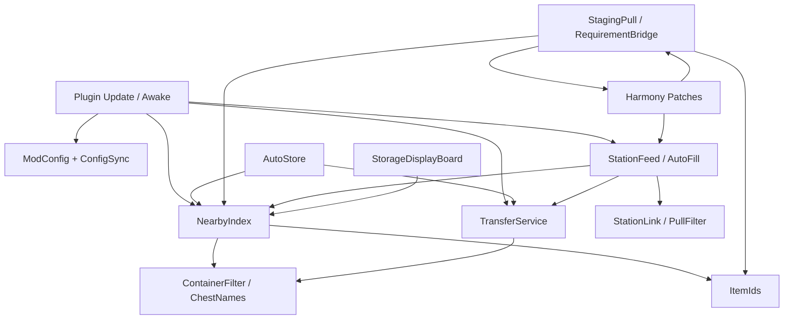

# StoreAndCraft – Architecture

Documented from the repository as of the analysis pass. Do not invent systems that are not in the code.

**Stack:** BepInEx plugin + Harmony patches. **No Jotunn.** Soft reflection bridge for Epic Loot when that assembly is present.

**Version (csproj / manifest at analysis time):** `1.3.39`. Config protocol: `ModConfig.ProtocolVersion = 13`.

---

## Entry point and lifecycle

| Piece | Role |
|-------|------|
| `Plugin` (`Plugin.cs`) | `BaseUnityPlugin`, GUID `Mordi.StoreAndCraft`. Awake: Harmony patch-all, `ModConfig`, soft deps, piece tables, feeder, display prefabs, RPCs. `Update`: tick loops. |
| `ModConfig` | BepInEx config + `ZPackage` sync (`ConfigSync` / `ConfigSyncRetry`). |
| `VersionGate` | Client/server version gate on join. |
| `Harmony.PatchAll` | All `[HarmonyPatch]` types in the assembly. |

### `Plugin.Update` / `LateUpdate` (verified from `Plugin.cs`)

Always (when running):

1. `ConfigWatch.Tick`
2. `TransferService.Tick` (queued moves; runs on dedicated too)

**Dedicated** (`ZNet.instance.IsDedicated()`): then only `AutoIntake.TickDedicated`, then **return** (no NearbyIndex / StationAutoFill / Hotkeys on the dedicated process).

**Client / listen-server with local player:**

3. `NearbyIndex.Tick`
4. `PendingChestDebit.Tick`
5. `AutoIntake` (dedicated-style if `IsServer()`, else local)
6. `AutoStack.Tick`, `SearchPing.Tick`
7. Display / filter menu ticks
8. `StationAutoFill.Tick` (per-station autofill pulses)

`LateUpdate`: `Hotkeys.Tick` (and station-hover / StationLink frame reset).

`StationFeed` has **no** `Tick` — it is a helper API used by autofill and cook patches. Feed trough runs via its own `MonoBehaviour` + Harmony patches, not this Update list.

Harmony patches run on vanilla call sites independently of this loop.

---

## Core systems

### 1. Storage discovery and cache — `World/NearbyIndex.cs`

- Scans player-built `Container`s near the local player (and station-origin helpers).
- Maintains `NearbyIndex.Current` and count helpers (`CountItem`, spendable maps for autofill).
- Calls `EnsureInventory` so ZDO-backed inventories are readable without casually wiping chests.
- Used by: auto-store, craft counting, staging consume, station feed, build grab, displays, filters.

### 2. Container policy — `World/ContainerFilter.cs`, `World/ChestNames.cs`

- **Usable storage:** player-built, not in use wrongly, not ignored.
- **Name tags on chest names:**
  - `[I]` — ignored by mod operations (`ChestNames.IsIgnored`).
  - `[H]` — hotbar-related naming (see hotkey/sort paths).
  - `[lN]` / leave-amount naming — leave-N style chest naming where implemented.
- Distance helpers used with `StoreRange` / `CraftRange` / station ranges.

### 3. Item identity — `World/ItemIds.cs`

- Shared-name / drop-prefab helpers for matching stacks across inventory and chests.
- `ShouldLeaveOne` — stackable-only when `MaxStackSize > 1` (not a hardcoded idol list).
- Prefab resolve by shared token **or** prefab name (e.g. `VoltureMeat`) via ObjectDB; no fixed Volture allow-list.

### 4. Transfer / networking — `Network/TransferService.cs`

- RPCs on the **chest** `ZNetView`: `KAC_Remove`, `KAC_Consume`, `KAC_Deposit`, `KAC_StoreDrop`.
- Grant to requester via routed `KAC_Grant` on `ZRoutedRpc`.
- Queue of pending moves with per-tick budget (`MaxTransfersPerTick`).
- **If local peer owns the chest ZDO:** mutate inventory locally and save.
- **If not owner:** `InvokeRPC` to the owner peer; handlers (`OnRemove` / `OnConsume` / …) require `nv.IsOwner()`, ward access, and `SenderInRange`.
- Claim ownership only in narrow safe cases (e.g. store when local view ready and chest not in use; grab path). Prefer `ExecuteWithoutStealing` for queued ops.
- Dedicated: `TransferService.Tick` still runs; player-driven NearbyIndex/autofill do not (see Update above).

### 5. Config sync — `Network/ConfigSync.cs`, `ConfigSyncRetry.cs`, `VersionGate.cs`

- Host config pushed to clients as `ZPackage` (`ModConfig.WriteTo` / `ReadFrom`).
- Retry tick until sync succeeds.
- Version mismatch can block play (`VersionGate`).

### 6. Auto-store (push) — `Store/AutoStore.cs` (+ related store helpers)

- Stores player inventory items into matching nearby chests (routing, LeaveOne interaction).
- Respects ignored chests and config ranges.

### 7. Craft-from-storage — `Craft/StagingPull.cs`, `RequirementBridge.cs`, patches

- **Count path:** `RequirementBridge.CountNearby` → `NearbyIndex.CountItem` with LeaveOne rules; Harmony on inventory count / UI requirement display (`InventoryCountPatches`, `UiPatches`).
- **Spend path:** `PlayerCraftPatches` → `StagingPull.ConsumeRequirements` removes deficit from chests **without** staging full stacks into the backpack (avoids “mats appear, craft fizzles”).
- `LeaveOneInChests`: off for upgrade-forge (`m_upgrader`) so unique idols remain spendable.

### 8. Station linking and feed — `StationLink`, `StationFeed`, `StationAutoFill`, `StationPullFilter`, `StationFilterMenu`, `CookingAutoDrop`

- **`StationAutoFill`:** registers and pulses `Smelter`, `Fireplace`, `CookingStation`, `Fermenter`, `Turret`, food `ItemStand` trays. Toggle ZDO `SAC_autoFill` (default key B).
- **`StationFeed`:** pull helpers (`EnsureInInventory`, `EnsureForUse`, cook `dropPrefab` stamping).
- **`StationLink`:** ZDO `SAC_stationLink` + chest name `[l1]`…`[l9]`.
- **`StationPullFilter`:** per-station allow/deny for multi-input stations (Alt+E menu).
- **`CookingAutoDrop`:** finished cook/honey → **ground** drop (ZDO `SAC_autoDrop`), not direct chest deposit.
- Full matrix: `Docs/Behavior.md` (Station systems).

### 9. Build grab — `Craft/BuildGrab.cs`

- Shift+place / grab materials from chests while building (LeaveOne aware).

### 10. Epic Loot soft bridge — `Craft/EpicLootBridge.cs`

- Reflection-only; no hard dependency.
- Enchanting spend from chests **without** LeaveOne (single runestone must remain usable).

### 11. Remote automation — removed (1.3.43)

- Former `Craft/RemoteAutomation.cs` (feed, output→chest, keep-alive / zone patches) deleted.
- Config keys and ProtocolVersion fields removed (`ProtocolVersion` 14).
- Distinct from earlier **remote dump** removal in 1.3.1.

### 12. Feed trough — `Feed/FeedTrough.cs`

- Periodic animal feed from storage / trough behavior (`Tick` from Plugin).

### 13. Storage Display — `Display/*`

- **Vanilla path (shipped):** clones wood `sign` prefab → scale + `StorageDisplayBoard`; Medium/Large get thinned solid `BoxCollider`s (`SoftenColliders`). Interact via `Sign.Interact` → board menu; Small uses hotbar 1–8.
- **Carved path (code present, not player-exposed):** `CarvedDisplaysExposed => false`; `IncludeDisplayBundle` defaults false in csproj. When enabled, `DisplayVisual` loads `displays/sac_displays` bundle, parents `SacModel`, `FitCollider`, `LiftSnapPoints` (tag `snappoint` / name `SacSnap`).
- Bundle manifest assets: `small_vertical`, `small_horizontal`, `medium_vertical`, `medium_horizontal`, `large_vertical`, `large_horizontal` (Unity 6000.0.75f1).
- No `Rigidbody` added by mod display code.

### 14. UI assets / fonts — `UI/UiAssets.cs`, `UI/UiFonts.cs`

- Loads PNG UI sprites from `Content/UI`.
- Filter menus, display board chrome, apply buttons, etc.

### 15. Input — `Input/Hotkeys.cs` (and Plugin key handling)

- Store-all, sort, pull-stack, craft helpers, station filter opens — bound via config.
- Must stay consistent with hover-text hints on stations/chests.

### 16. Harmony surface (selected)

| Area | Files |
|------|--------|
| Craft spend / have-reqs | `PlayerCraftPatches`, `InventoryCountPatches`, `UiPatches` |
| Stations / hover / cook | `StationPatches` |
| Chest wipe races | `ChestLoadGuardPatch` (`Inventory.Load`, `Container.Save`) |
| UI / inventory | `UiPatches`, sort/hotbar patches as present |
| Feeder / pieces | piece registration + feeder patches |

### 17. Persistence

- Vanilla ZDO / container inventory for chests and stations.
- Mod ZDO custom data for links/filters/displays where coded on those components.
- BepInEx config file + network sync for shared settings.
- Display board UI state is runtime; piece placement is world ZDO.

---

## Dependency diagram

---

## Data flows (verified)

### Auto-store

Player hotkey / trigger → policy checks → `NearbyIndex` chests in `StoreRange` → match item to chest → `TransferService.StoreItem` (local claim if safe, else RPC deposit) → inventory remove / chest add.

### Craft from storage

UI / `HaveRequirements` → count patches add `RequirementBridge.CountNearby` → player crafts → `ConsumeResources` postfix/prefix → `StagingPull.ConsumeRequirements` → per-chest consume with LeaveOne → Transfer consume RPCs as needed.

### Station autofill

`StationFeed.Tick` → resolve station + link/filter → `NearbyIndex` / linked chests → select fuel/ore/food via `ItemIds` → transfer into station inventory (ownership-safe).

### Storage Display

Piece placed → `StorageDisplayBoard` binds to storage → periodic/`RebuildUiNow` paints item cells from chest inventories via index/ensure → filter menu updates allowed types.

---

## Soft-disabled / packaging gates

| Gate | Effect |
|------|--------|
| `DisplayPrefab.CarvedDisplaysExposed => false` | Carved prefabs not registered |
| `IncludeDisplayBundle` default `false` (csproj) | `sac_displays` not copied into packs unless explicitly enabled |

Treat gated code as **present but not product-default**.

---

## What is intentionally absent

- **Jotunn** — not referenced.
- **Remote dump** — removed in 1.3.1.
- **Remote Automation** — removed in 1.3.43 (file, config, zone keep-alive patches).
- **StationAutoFill for SpinningWheel** — not registered.
- **Direct station→chest output** — not implemented; live path is AutoDrop→ground→intake.
